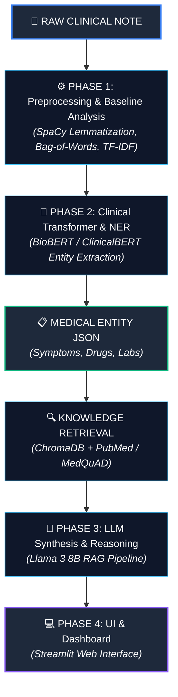

# ClinicaRAG: An LLM-Based Clinical Decision Support System

---

## 📌 Project Overview & Team Details

* **Institution:** Koneru Lakshmaiah Education Foundation (KLH University, Bachupally-Gandimaisamma Road, Bowrampet, Hyderabad, Telangana - 500043)
* **Domain:** Healthcare & Medical Natural Language Processing (NLP)
* **Team Name:** Team 9
* **Project Supervisor:** *Dr. K Swanthana*

### 👥 Team Members

| S.No. | Roll No. | Student Name |
| :---: | :---: | :--- |
| 1 | 2420030057 | P Dhanush |
| 2 | 2420080098 | Tannishtha Verma |
| 3 | 2420090147 | M Rohith |

---

## 📝 Abstract

Clinical documentation contains critical patient data, but its unstructured nature makes it difficult for practitioners to extract immediate, evidence-based insights. This project proposes **ClinicaRAG**, an advanced Clinical Decision Support System (CDSS) that integrates domain-specific encoders with Retrieval-Augmented Generation (RAG) to provide verifiable diagnostic assistance. The system utilizes BioBERT or ClinicalBERT for fine-grained Named Entity Recognition (NER) to extract symptoms, diagnoses, and medications from raw clinical notes. To ensure medical accuracy and minimize hallucinations, the framework incorporates a RAG pipeline that fetches relevant medical evidence from trusted sources like PubMed and MedQuAD.

The proposed architecture involves rigorous text preprocessing using lemmatization and tokenization via SpaCy to clean and structure raw clinical text. A high-performance vector database, ChromaDB, is implemented to index and search medical knowledge bases for context-aware evidence gathering. The final clinical synthesis and reasoning are performed by a quantized Llama 3 (8B) model, which generates suggested differential diagnoses, recommended tests, and treatment rationales with verifiable back-referenced citations. The system provides a transparent, Streamlit-based dashboard for healthcare professionals to interact with AI-driven clinical insights, improving medical decision-making and patient outcomes.

---

## 🏗 System Architecture & Workflow

---

## 📊 Datasets Used

| Dataset | Description / Sourced From | URL Link |
| :--- | :--- | :--- |
| **MedQuAD** | Medical QA dataset (16,359 valid records from NIH) | [GitHub Repository](https://github.com/abachaa/MedQuAD) |
| **PubMed / PubMedQA** | Biomedical question answering dataset & transcripts | [HuggingFace Dataset](https://huggingface.co/datasets/bigbio/pubmed_qa) |
| **MIMIC-III** | De-identified ICU clinical database | [PhysioNet MIMIC-III](https://physionet.org/content/mimiciii/) |
| **Clinical Notes** | Medical transcriptions raw / Fallback dataset | [Kaggle Dataset](https://www.kaggle.com/datasets/tboyle10/medicaltranscriptions) |

---

## 🛠️ Tech Stack & Core Technologies

* **NLP & Processing:** SpaCy, NLTK, TF-IDF, Bag-of-Words
* **Clinical Transformers (NER):** BioBERT, ClinicalBERT
* **LLM Engine:** Llama 3 (8B - Quantized)
* **Vector Database & RAG:** ChromaDB
* **User Interface:** Streamlit Dashboard
* **Programming Language:** Python 3.10+
